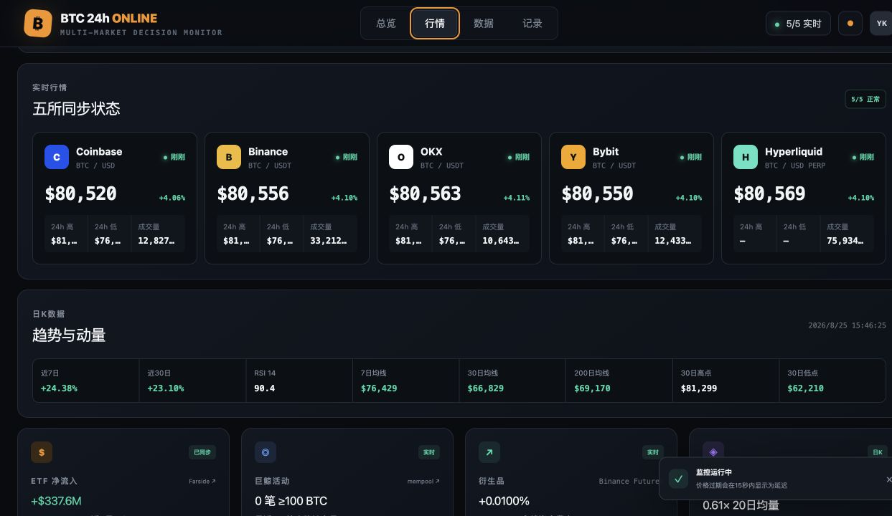
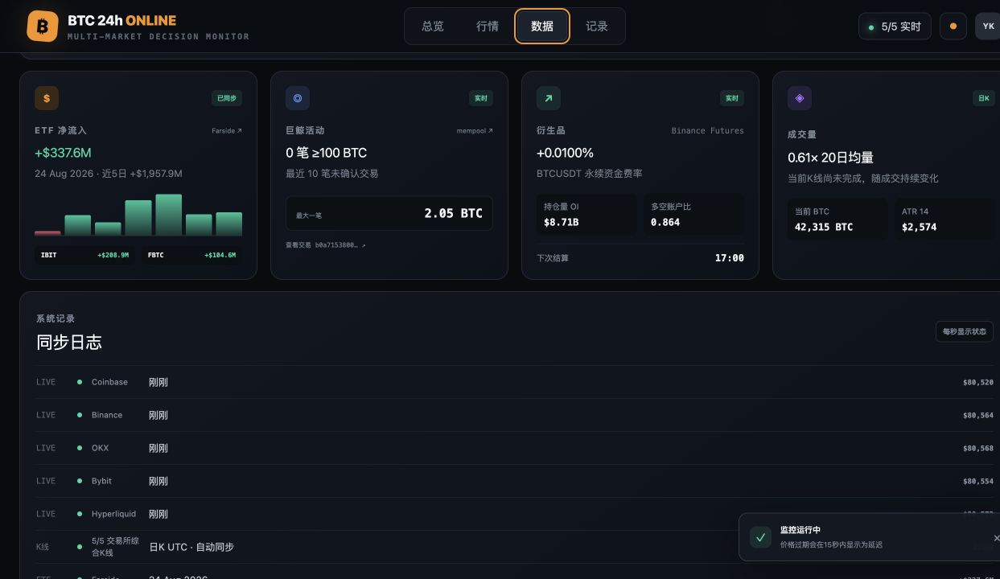

# BTC 24h ONLINE

实时聚合 Coinbase / Binance / OKX / Bybit / Hyperliquid 五大交易所行情，结合 ETF 资金流、链上巨鲸交易与合约数据，对未来 K 线做情景化概率推演的 BTC 行情看板。

Real-time BTC dashboard that aggregates live prices from five exchanges, layers in ETF flow / whale / derivatives intelligence, and produces probability-weighted scenario forecasts for upcoming candles.

**[English](#english) · [简体中文](#简体中文)**

---

## 简体中文

### AI 预测 BTC K 线走向系统

BTC 24h ONLINE 不是自动交易机器人，也不只是一个价格看板。它把五大交易所行情、技术指标、ETF 资金、巨鲸交易和衍生品数据放到同一套判断框架中，对后续 BTC K 线进行概率推演。

系统会生成未来的虚拟 K 线，并逐根说明：为什么这根可能走高或走低、依据来自哪里、需要看到什么才算确认，以及价格到哪里代表判断失效。用户可以切换小时 K、日 K、月 K，以及 3 天、7 天、14 天的推演范围。

#### 系统界面

**AI K 线走向推演与逐根判断理由**


**五大交易所实时行情与技术指标**



**ETF、巨鲸、衍生品与成交量监控**



#### 系统如何判断

- **五所实时行情**：通过 WebSocket 同时订阅 Coinbase、Binance、OKX、Bybit、Hyperliquid，展示综合价格、涨跌幅、24h 高低点与成交量，超过 15 秒未更新自动标记为延迟。
- **多周期 K 线**：支持小时 / 日 / 月三种周期，把五所 K 线按同一时间桶聚合，使用中位数开盘价与收盘价、最高/最低价和合计成交量，减少单一交易所异常数据的干扰。
- **技术指标**：结合 SMA7 / SMA30 / SMA200、RSI14、ATR14、30 周期高低点和 20 周期均量比判断趋势、动量与常见波动范围。
- **资金与市场数据**：把 Farside ETF 净流入、mempool.space 巨鲸交易、Binance 合约资金费率与持仓量纳入判断，不只依赖交易所涨跌方向。
- **三种推演情景**：生成基准震荡、向上突破、回撤修正三条可能路径，并给出各自的概率、推演区间和失效位。
- **逐根解释**：每一根虚拟 K 线都提供自然语言理由，分别说明 K 线结构、RSI、均线、成交量、ETF、衍生品和五所市场共振如何影响判断。

> 虚拟 K 线是基于当前数据的概率推演，不是真实未来报价，也不构成投资建议。

### 技术栈

- [Next.js](https://nextjs.org/) 16（通过 [vinext](https://github.com/cloudflare/vinext) 跑在 Vite 之上）
- React 19 + TypeScript
- Tailwind CSS v4
- Cloudflare Workers（[@cloudflare/vite-plugin](https://github.com/cloudflare/workers-sdk)，含 D1 / R2 绑定预留）
- 数据源：Binance / Coinbase / OKX / Bybit / Hyperliquid 公开行情接口、Farside、mempool.space

### 本地开发

需要 Node.js ≥ 22.13。

```bash
npm install
npm run dev
```

默认访问 `http://localhost:3000`（若端口被占用，`vinext dev` 会提示已在运行的实例）。

```bash
npm run build   # 生产构建
npm run start   # 本地跑生产构建
npm run lint    # ESLint 检查
```

### 项目结构

```
app/
  page.tsx                 客户端看板主组件（行情、图表、预测面板）
  api/daily/route.ts        聚合五所K线，计算技术指标与多所共识
  api/intelligence/route.ts ETF / 巨鲸 / 合约数据接口
  globals.css                样式
public/                     静态资源（favicon、og 图）
```

### 部署

生产构建产物兼容 Cloudflare Workers（`dist/server/wrangler.json` 由 `@cloudflare/vite-plugin` 自动生成）。可通过 vinext 官方 Cloudflare 部署命令发布：

```bash
npx @vinext/cloudflare deploy
```

部署前需要先执行 `wrangler login` 完成 Cloudflare 账号授权。

> 注：项目内的 `.openai/hosting.json` 是该项目最初在 ChatGPT Sites 中创建时生成的托管元数据，与 Cloudflare 部署互不影响，可以按需保留或移除。

### 免责声明

预测面板中的"虚拟 K 线"是基于当前数据的情景推演，不代表未来真实报价，也不构成任何投资建议。请自行判断风险。

---

## English

### Overview

A multi-exchange BTC decision dashboard:

- **Live 5-exchange feed** — simultaneous WebSocket subscriptions to Coinbase, Binance, OKX, Bybit, and Hyperliquid, with a composite price, 24h change/high/low/volume, and automatic "stale" flagging after 15 seconds of silence.
- **Multi-timeframe candles** — hourly / daily / monthly views, aggregated across all five exchanges into a single candle per time bucket (median open/close, max/min high/low, summed volume) to smooth out single-exchange noise.
- **Technical indicators** — SMA7 / SMA30 / SMA200, RSI14, ATR14, 30-period high/low, and a 20-period volume ratio.
- **Scenario forecasting** — base / breakout / pullback scenarios are generated from cross-exchange direction agreement, volume confirmation, moving-average structure, RSI, ETF flow, and funding rate. Each forecast candle ships with a plain-language rationale (why it moves, what would confirm it, what would invalidate it).
- **On-chain & market intelligence** — Farside ETF flow data, mempool.space whale-transaction monitoring, and Binance funding rate / open interest.

The forecast panel is explicitly labeled as probabilistic scenario analysis, not a live quote or investment advice.

### Tech stack

- [Next.js](https://nextjs.org/) 16 running on Vite via [vinext](https://github.com/cloudflare/vinext)
- React 19 + TypeScript
- Tailwind CSS v4
- Cloudflare Workers via [@cloudflare/vite-plugin](https://github.com/cloudflare/workers-sdk) (D1 / R2 bindings reserved)
- Data sources: public REST/WebSocket APIs from Binance, Coinbase, OKX, Bybit, and Hyperliquid, plus Farside and mempool.space

### Local development

Requires Node.js ≥ 22.13.

```bash
npm install
npm run dev
```

Serves at `http://localhost:3000` by default (if the port is taken, `vinext dev` will point you to the already-running instance).

```bash
npm run build   # production build
npm run start   # run the production build locally
npm run lint     # ESLint
```

### Project structure

```
app/
  page.tsx                  Client dashboard (feed, chart, forecast panel)
  api/daily/route.ts        Aggregates 5-exchange candles, computes indicators + consensus
  api/intelligence/route.ts ETF / whale / derivatives data endpoint
  globals.css                Styles
public/                      Static assets (favicon, og image)
```

### Deployment

The production build is Cloudflare Workers-compatible (`dist/server/wrangler.json` is generated by `@cloudflare/vite-plugin`). Deploy with vinext's official Cloudflare command:

```bash
npx @vinext/cloudflare deploy
```

Run `wrangler login` first to authorize your Cloudflare account.

> Note: `.openai/hosting.json` is hosting metadata generated when this project was originally scaffolded in ChatGPT Sites. It doesn't affect Cloudflare deployment and can be kept or removed as needed.

### Disclaimer

The "virtual candles" in the forecast panel are scenario projections based on current data — they are not real future quotes and do not constitute investment advice. Use at your own risk.
